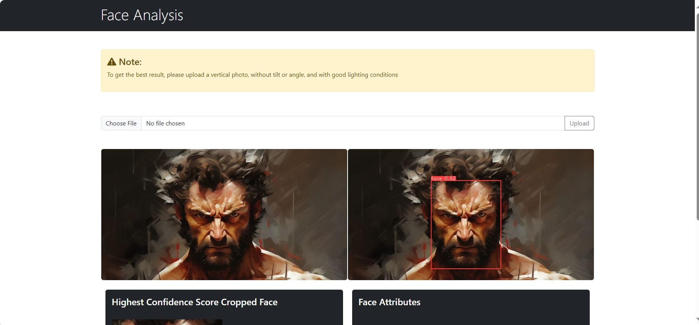

# AI Hackathon Face Analysis Challenge 2024

Face analysis is the process of using technology to analyze human facial features to understand information such as age, gender, mood, and many other factors => applied in many fields. ranging, including industrial, medical, security, and entertainment
. In this [Challenge](https://hackathon.pixta.vn/), participants will build ideas and apply technology to identify all facial features such as: Gender, Age, Ethnicity, Skin color, Wearing a mask/ Not wearing a mask, Feeling emoji, Face recognition, ...

This repo is one of the pieces of code that helped us achieve the RUNNER UP in final round.

Authors:
- Trong Anh Nguyen (Anhnguyen.0912a@gmail.com)
- Quan Van Nguyen (21521333@gm.uit.edu.vn)
- Khoa Dang Nguyen (garuwriters@gmail.com)

January 27, 2024